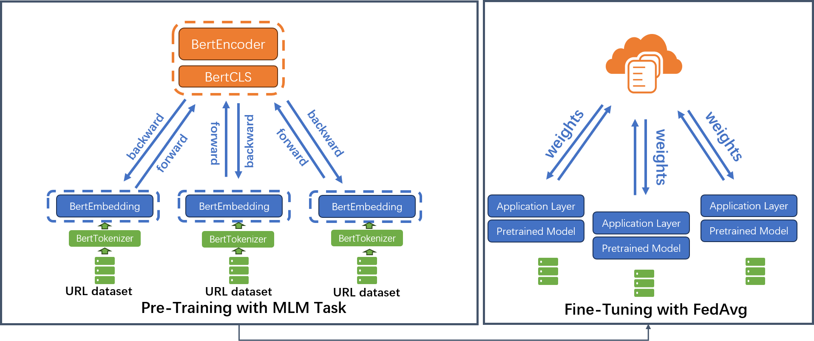
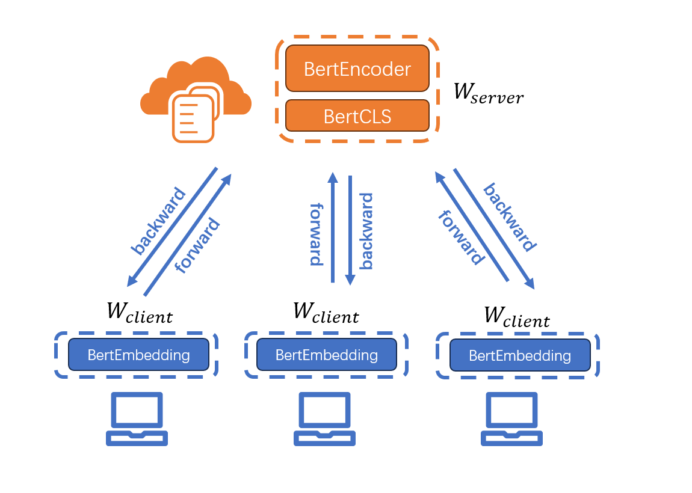
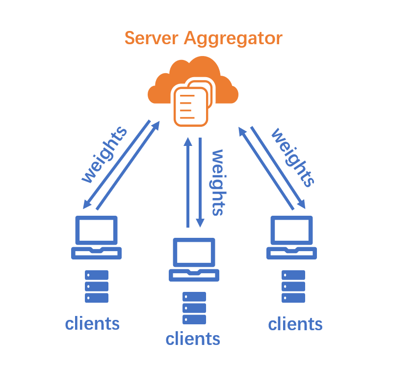

# FedURLBERT: Efficient Federated Learning on Pre-Trained Language Models for Detecting Malicious URL

This is an implementation of the paper - "FedURLBERT: Efficient Federated Learning on Pre-Trained Language Models for Detecting Malicious URL"

### Overview

In order to safeguard user data privacy, we employed a decentralized URL dataset and combined federated learning with split learning to pre-train and fine-tune the BERT model for phishing website detection. The resulting model achieves outstanding performance in predicting phishing webpages and demonstrates comparable performance to models trained using centralized training during the fine-tuning stage.

### Model Designs

- Over all framework

  

- Pre-train stage

  

- Fine-tuning stage

  

### Directory Guide

|     Folder/File Name      | Description                                                  |
| :-----------------------: | :----------------------------------------------------------- |
|    ./FedPretrain.ipynb    | The program for pre-training the BERT model using a URL dataset |
|    ./FineTuning.ipynb     | The program for fine-tuning the BERT model with centralized training |
|     ./fine_tuning.csv     | The dataset for fine-tuning stage                            |
|        ./train.csv        | The dataset for pre-training stage                           |
|     ./bert_tokenizer      | The folder contains the vocabulary used for the tokenizer. You can also adjust the program parameters to generate a new one. |
| ./bert-base-uncased-model | The folder contains the model parameters used to build BERT. You can also customize parameters to adjust the model. |
|         ./FedBert         | The folder is designated to store the generated pre-trained model files |
|       ./30epochiid        | The directory contains programs used for fine-tuning the model when both the dataset and test set follow an independent and identically distributed (IID) pattern. Specifically, the folders 'fedavg' and 'Fedavg_ALA' respectively house programs implementing the FedAvg algorithm and its enhanced variant. |
|      ./30epochNoniid      | The directory comprises programs for model fine-tuning under non-independent and identically distributed (non-IID) dataset conditions. Within this, the folders 'testDatasetiid' and 'testDatasetNoniid' represent scenarios where the test dataset adheres to either an independent and identically distributed (IID) or non-IID pattern respectively. The structure within this layer of folders remains consistent with '30epochiid'. |

### Requirements

``` python
Python==3.8

numpy==1.24.3
pandas==2.0.2
tokenizers==0.14.1
torch==1.13.1+cu117
torchaudio==0.13.1+cu117
torchvision==0.14.1+cu117
transformers==4.34.1
xlwt==1.3.0
```

### Usage

In all datasets for training or testing, each line includes the label and the URL text string following the template:

<label>  <URL string>

for example:

```python
2 http://minsotc.alania.gov.ru  # 2 : Legitimate; 1 : Phishing
1 http://zonaderegistrosenlineabnweb1.com/BNWeb/lnicio/ 
```

You can adjust the program's hyperparameters according to your needs to adjust the model's training. Each `.ipynb` file is standalone, yet you must run the model pre-training before executing the model fine-tuning program.

To run experiments for each stage, simply execute the corresponding file within the directory. You can comment out the final code blocks responsible for outputting XLS files, as they serve no significant purpose during the experimental process and are solely for recording certain data operations. The adjustable program hyperparameters and their respective locations have been listed below for your reference.

#### Pre-train

| Hyperparameter |              Location               | Description                                                  |
| :------------: | :---------------------------------: | ------------------------------------------------------------ |
|   vocab_size   | `FedPrtrain.ipynb/ Block 1 Line 8`  | The vocabulary size of the tokenizer                         |
| config_kwargs  | `FedPrtrain.ipynb/ Block 4 Line 7`  | Configuration Parameters of the BERT Model                   |
|       lr       | `FedPrtrain.ipynb/ Block 8 Line 12` | learning rate of the training                                |
|      frac      | `FedPrtrain.ipynb/ Block 8 Line 11` | The proportion of randomly selected clients in each training epoch |
|   num_users    | `FedPrtrain.ipynb/ Block 8 Line 9`  | The total number of clients involved in training             |
|     epochs     | `FedPrtrain.ipynb/ Block 8 Line 9`  | The total number of training epochs                          |
|       df       | `FedPrtrain.ipynb/ Block 3 Line 3`  | The path for the training dataset needs to be adjusted according to the actual circumstances |

#### Fine-tuning

The programming style across the programs in the fine-tuning stage is consistent. Here I take the hyperparameters of the improved approach under the scenario where the training and test sets adhere to the same Dirichlet distribution as an example,  and you can also find corresponding parameters in similar locations within other files.

| Hyperparameter  |     Location      | Description                                                  |
| :-------------: | :---------------: | ------------------------------------------------------------ |
|    df_train     | `Block 3 Line 11` | The path for the training dataset needs to be adjusted according to the actual circumstances |
|  EmbeddingPath  | `Block 7 Line 3`  | The saved path for the pre-trained model's Embedding layer, which needs to be modified for practical use |
| TransformerPath | `Block 7 Line 4`  | The saved path for the pre-trained model's Transformer layer, which needs to be modified for practical use |
|    num_users    | `Block 7 Line 5`  | The total number of clients involved in training             |
|  local_epochs   | `Block 7 Line 7`  | The number of local training epochs for the model during the training process |
|      frac       | `Block 7 Line 6`  | The proportion of randomly selected clients in each training epoch |
|     epochs      | `Block 7 Line 8`  | The total number of training epochs                          |
|      alpha      | `Block 9 Line 15` | The parameter α of the Dirichlet distribution                |
|   Client.ala    | `Block 17 Line 9` | You can separately set the ratio of training dataset data used during local initialization, the learning rate for this process, the threshold for loss value variance, and the maximum number of initialization training epochs |
